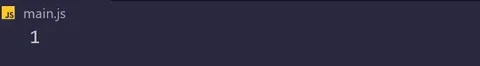

<!-- ## ¡Hola! soy Roberto Mejía 🖐️ -->

Apasionado por la tecnología me centro en la necesidad de escribir código limpio y eficiente. 
<!-- Usando las tecnologías HTML5, CSS3, y JS entre otras.  -->

<!--  -->
<!--
### Tecnologias y herramientas del día a día

  
  
  
  
  
  
  
  
  
  
  
  
  
  
  
  
  
  
  
  
  <!-- 
   -->
  <!--  -->
  <!--  

 
-->
### Tecnologías y herramientas de día a día
[]

### Formación autodidacta

  
  
  
  

 
